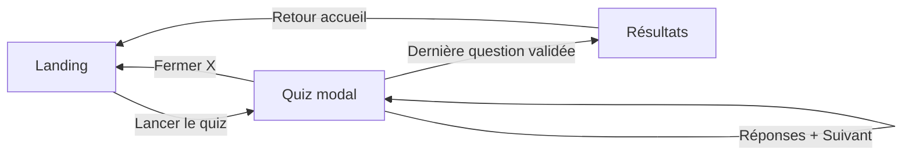

# Quiz Deffinov 

Site web statique : quiz de sensibilisation aux missions et à l’offre de la **MJC Morlaix**, dans le cadre plus large du programme territorial **Deffinov** (Pays de Morlaix).

---

## 1. Besoins du client

### Contexte territorial

Le programme [Deffinov](https://www.resam.net/deffinov-une-matinee-pas-comme-les-autres-au-2d-pour-lancer-la-co-construction.html) vise à **créer des liens entre la formation et les lieux-ressources** du Pays de Morlaix, en ciblant notamment les **18–30 ans**. Il s’appuie sur une **co-construction** avec partenaires et jeunes autour d’outils (dont un jeu de piste) permettant de **mieux connaître les dispositifs disponibles sur le territoire**. La MJC de Morlaix est l’une des structures impliquées dans cette dynamique.

### Objectifs opérationnels du présent livrable


| Enjeu                                                  | Réponse apportée                                                                                               |
| ------------------------------------------------------ | -------------------------------------------------------------------------------------------------------------- |
| **Visibilité** des missions MJC / Information Jeunesse | Parcours court, ludique, accessible en ligne.                                                                  |
| **Orientation** vers les canaux officiels              | Liens directs vers le site MJC Morlaix et l’Information Jeunesse.                                              |
| **Pédagogie légère**                                   | Questions à réponses ouvertes normalisées côté client, feedback immédiat par score et messages contextualisés. |
| **Simplicité de maintenance**                          | Stack sans serveur d’application ni base de données ; hébergement statique.                                    |


### Problématiques initiales adressées

- Rendre **digestible** une partie des informations institutionnelles (adhésion, espaces, équipe, etc.) sans parcours documentaire lourd.
- Proposer un **point d’entrée numérique** cohérent avec les objectifs Deffinov (connaissance des ressources locales), **sans dépendre d’un backend** pour réduire coût et complexité.
- Assurer une **expérience utilisable sur mobile** (mise en page responsive).

---

## 2. Architecture du projet

### Stack technique

- **HTML5** : structure sémantique (`header`, `main`, `section`), attribut `lang="fr"`.
- **CSS3** : feuille de styles dédiée, media queries pour petits écrans.
- **JavaScript (vanilla)** : logique du quiz, gestion des vues (accueil / quiz / résultats), validation des réponses, aucune dépendance npm.

### Arborescence

```
deffinovMJC/
├── index.html                 # Page unique : landing, modal quiz, écran résultats
├── LICENSE
├── README.md
└── assets/
    ├── css/
    │   └── style.css          # Styles globaux et responsive
    ├── js/
    │   └── quiz.js            # Données des questions, état, événements DOM
    └── images/
        └── mjc-removebg-preview.png
```

### Schéma de flux (logique applicative)




### Points d’attention techniques

- Les **réponses acceptées** et le **barème** sont définis dans `assets/js/quiz.js` : toute évolution du contenu éditorial se fait dans ce fichier.
- **Pas d’API** : pas de persistance des scores ni d’authentification ; l’exécution est entièrement côté navigateur.

---

## 3. Cybersécurité

### Mesures inhérentes au modèle

- **Site statique** : surface d’attaque serveur réduite (pas d’interprétation PHP/SQL côté hébergeur pour ce dépôt).
- **GitHub Pages** : diffusion en **HTTPS** par défaut pour les pages `*.github.io`.
- **Pas de cookies ni de stockage local** utilisé pour le quiz dans l’état actuel du code : pas de traçage applicatif côté client au-delà de la session navigateur.

### Limites à connaître (conception)

- Les **bonnes réponses** sont présentes dans le JavaScript livré au navigateur : le quiz n’est **pas** un mécanisme d’évaluation sécurisée ou anti-triche ; il s’agit d’un **outil de sensibilisation**, pas d’un examen certifiant.
- Liens externes ouverts via `window.open` : comportement classique ; l’utilisateur quitte le périmètre du site cible.

### Pistes d’amélioration (optionnel)


| Mesure                                                               | Intérêt                                                                         |
| -------------------------------------------------------------------- | ------------------------------------------------------------------------------- |
| **Content-Security-Policy (CSP)** en en-tête HTTP                    | Réduit les risques XSS en limitant les sources de scripts et de contenus.       |
| `**rel="noopener noreferrer"`** sur les liens externes               | Limite l’exposition via `window.opener` lors d’ouverture dans un nouvel onglet. |
| Remplacer les `onclick` inline par des écouteurs dans `quiz.js`      | Facilite l’application d’une CSP stricte (`script-src 'self'`).                 |
| **Sous-domaine dédié** + en-têtes **HSTS** (si domaine personnalisé) | Renforce la confiance en la livraison TLS.                                      |
| Revue des **dépendances** si le projet évolue (bundler, frameworks)  | S’applique surtout si des paquets npm sont ajoutés plus tard.                   |


---

## 4. Méthode de déploiement | GitHub Pages

Le déploiement cible **GitHub Pages** : le contenu du dépôt est servi comme site statique.

### Prérequis

- Compte GitHub et dépôt contenant ce projet (branche de publication configurée, en général `main` ou `gh-pages`).

### Étapes typiques

1. **Pousser** le code sur GitHub (`git push`).
2. Dans le dépôt : **Settings → Pages**.
3. **Source** : *Deploy from a branch*.
4. Choisir la **branche** (ex. `main`) et le dossier `**/ (root)`**, car `index.html` est à la racine du dépôt.
5. Enregistrer. L’URL publique est du type `https://<utilisateur>.github.io/<nom-du-depot>/` (ou domaine personnalisé si configuré).

### Vérifications post-déploiement

- Ouvrir l’URL en navigation privée pour valider le chargement de `assets/css/style.css`, `assets/js/quiz.js` et `assets/images/mjc-removebg-preview.png` (chemins relatifs depuis la racine du site).
- Si le dépôt est **privé**, vérifier les règles GitHub applicables à Pages selon l’offre du compte.

### Environnement de développement local (optionnel)

Tout serveur de fichiers statiques suffit, par exemple :

```bash
# Python 3
python3 -m http.server 8080
```

Puis ouvrir `http://localhost:8080` dans le navigateur.

---

## 5. Ce que fait l’application / le site

1. **Page d’accueil**
  - Affiche le bandeau avec le logo MJC et le titre « Quiz Deffinov ».  
  - Trois actions : ouverture du site MJC Morlaix, du site Information Jeunesse Morlaix (nouvel onglet), et **Lancer le quiz**.
2. **Quiz**
  - Fenêtre modale plein écran (fond assombri) avec une question à la fois.  
  - Saisie **texte libre** ; validation par bouton **Suivant** ou touche **Entrée**.  
  - Réponses vides refusées avec message d’alerte.  
  - Comparaison **insensible à la casse** avec une liste de variantes acceptées par question.  
  - Bouton **X** pour quitter le quiz et revenir à l’accueil (score remis à zéro).
3. **Résultats**
  - Affichage du **score** sur le nombre total de questions.  
  - Message adapté selon la tranche de score (ex. messages pour scores faibles vs. scores intermédiaires).  
  - Bouton **Retour à l’accueil**.

Aucune collecte de données personnelles, aucun compte utilisateur, aucun envoi de réponses vers un serveur : le comportement est entièrement **local au navigateur**.

---

## Licence

Voir le fichier `LICENSE` à la racine du dépôt.
